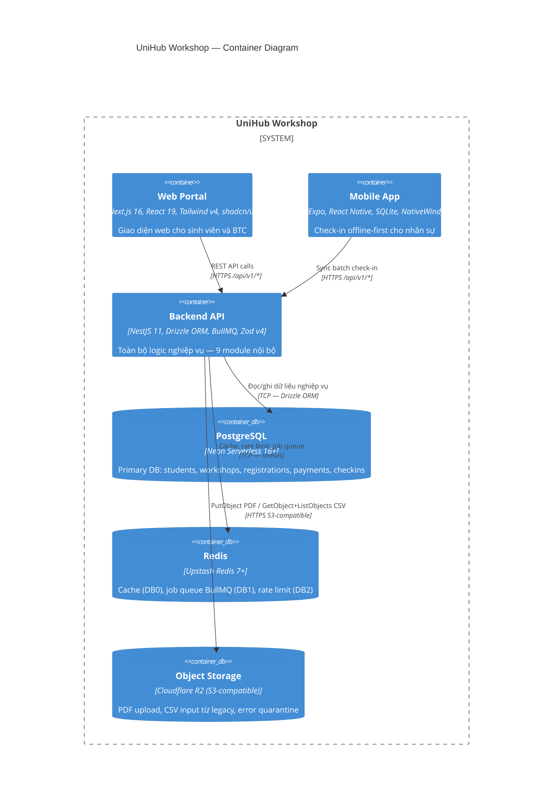

# C4 Diagram — Level 2: Container

Phân rã UniHub Workshop thành các container độc lập: công nghệ từng container và cách chúng giao tiếp với nhau.

## Ghi chú chi tiết từng container

### Container 1: Web Portal

| Thuộc tính | Giá trị |
|-----------|---------|
| Công nghệ | Next.js 16 (App Router), React 19, TypeScript, Tailwind CSS v4, shadcn/ui |
| Vai trò | Giao diện web cho sinh viên (xem lịch, đăng ký, thanh toán, xem QR) và ban tổ chức (quản lý workshop, thống kê, upload PDF) |
| Giao tiếp với Backend | HTTPS REST — gọi `/api/v1/*` qua HTTP client với JWT access token |
| Giao tiếp với CDN | Next.js static assets được phục vụ qua CDN |
| Giao tiếp với người dùng | Browser rendering HTML/CSS/JS, form submission, polling cho AI summary status |
| Số lượng instance | 1 (Docker container) |
| Phụ thuộc | Backend API (mất API → web không hoạt động) |

### Container 2: Mobile App

| Thuộc tính | Giá trị |
|-----------|---------|
| Công nghệ | Expo SDK, React Native, TypeScript, SQLite (expo-sqlite + Drizzle ORM), NativeWind (Tailwind CSS v3) |
| Vai trò | Ứng dụng dành riêng cho nhân sự check-in. Quét mã QR, ghi nhận check-in offline, tự đồng bộ khi có mạng |
| Giao tiếp với Backend | HTTPS REST — sync batch 50 records/request, JWT access token (8 giờ cho mobile) |
| Offline capability | SQLite local — `local_checkins` table với `pending`/`synced`/`rejected`/`duplicate` status. Hoạt động không cần mạng |
| Conflict resolution | Server-wins, first-check-in-wins (`ON CONFLICT (registration_id) DO NOTHING`) |
| Số lượng instance | Nhiều (mỗi staff một device) |
| Phụ thuộc | Backend API (chỉ khi sync; offline hoàn toàn độc lập) |

### Container 3: Backend API

| Thuộc tính | Giá trị |
|-----------|---------|
| Công nghệ | NestJS 11, TypeScript, Express HTTP, Drizzle ORM, ioredis, BullMQ, Zod v4, bcrypt, passport-jwt, Winston |
| Vai trò | Modular Monolith với 9 module nội bộ: booking, catalog, payment, notification, checkin, ai-summary, csv-sync, iam, rate-limit, background |
| Giao tiếp với client | HTTPS REST (JSON) |
| Giao tiếp với PostgreSQL | TCP — Drizzle ORM connection pool (singleton, max 20 connections) |
| Giao tiếp với Redis | TCP — ioredis client, 3 logical databases (DB0: cache LRU, DB1: queues noeviction, DB2: rate limit volatile-ttl) |
| Giao tiếp với Object Storage | HTTPS S3-compatible API — `PutObject`/`GetObject` PDF, `ListObjectsV2`+`GetObject` CSV qua Cloudflare R2 |
| Giao tiếp với external | HTTPS — Payment Gateway (Wiremock), DeepSeek AI Provider (Anthropic SDK, `baseURL: https://api.deepseek.com/anthropic`); SMTP — Email Server |
| Không giao tiếp với | Không gọi ngược Legacy System (one-way CSV qua Object Storage) |
| Vòng đời request | Guard (JWT + RBAC) → Validation (Zod) → Controller → Service (`Result<T>`) → ResponseInterceptor → GlobalExceptionFilter |
| Số lượng instance | 1 (Modular Monolith, single process) |
| Phụ thuộc | PostgreSQL (cứng), Redis (mềm — degrade có kiểm soát) |

### Container 4: PostgreSQL

| Thuộc tính | Giá trị |
|-----------|---------|
| Công nghệ | PostgreSQL 16+ (Neon Serverless) |
| Vai trò | Primary database — single source of truth. Lưu: students, staff, workshops, registrations, payments, checkins, idempotency_keys, import_logs, notification_logs |
| Schema | 9 tables, optimized với partial indexes + composite UNIQUE constraints (xem ADR-02) |
| ACID | Row-level locking cho Optimistic Locking (ADR-03), `ON CONFLICT` cho idempotent upsert (ADR-08, ADR-12) |
| Connection pool | Max 20 connections, server-side pooling qua Neon |
| Số lượng instance | 1 (single-node — SPOF được chấp nhận) |

### Container 5: Redis

| Thuộc tính | Giá trị |
|-----------|---------|
| Công nghệ | Upstash/Redis 7+ |
| Vai trò | Ba nhiệm vụ độc lập trên 3 logical databases |
| DB0 — Cache | Cache-Aside, TTL 10s (seats_available), TTL 60s (workshop list). `maxmemory-policy: allkeys-lru` |
| DB1 — Job Queue | BullMQ cho AI summary + notification workers. `maxmemory-policy: noeviction` |
| DB2 — Rate Limiting | Sliding Window Sorted Set. `maxmemory-policy: volatile-ttl` |
| Số lượng instance | 1 (single-node — degrade có kiểm soát khi mất Redis) |

### Container 6: Object Storage

| Thuộc tính | Giá trị |
|-----------|---------|
| Công nghệ | Cloudflare R2 (S3-compatible Object Storage) |
| Vai trò | Lưu trữ file: PDF workshop upload, CSV đầu vào từ legacy system, file lỗi quarantine |
| Object keys | `workshops/{workshop_id}/{uuid}-{name}.pdf` (PDF upload), `students_YYYY-MM-DD.csv` (CSV input), `errors/students_YYYY-MM-DD.csv` (quarantine) |
| Truy cập | S3-compatible API — `PutObject` (upload), `GetObject` (đọc file buffer), `ListObjectsV2` (tìm file CSV theo prefix) |
| Credentials | Env: `R2_ACCOUNT_ID`, `R2_ACCESS_KEY_ID`, `R2_SECRET_ACCESS_KEY`, `R2_BUCKET_NAME` |
| Durability | Cloudflare R2 managed — không cần tự quản lý replication |

## Giao thức giao tiếp

| Từ | Đến | Giao thức | Ghi chú |
|----|-----|-----------|---------|
| Web Portal | Backend API | HTTPS REST | JWT access token trong Authorization header |
| Mobile App | Backend API | HTTPS REST | Sync batch 50 records/request; JWT 8h cho mobile |
| Backend API | PostgreSQL | TCP (Drizzle ORM) | Connection pool max 20, Neon serverless pooling |
| Backend API | Redis | TCP (ioredis) | 3 kết nối riêng theo logical database |
| Backend API | Object Storage | HTTPS S3-compatible | `PutObject`/`GetObject` PDF; `ListObjectsV2`+`GetObject` CSV |
