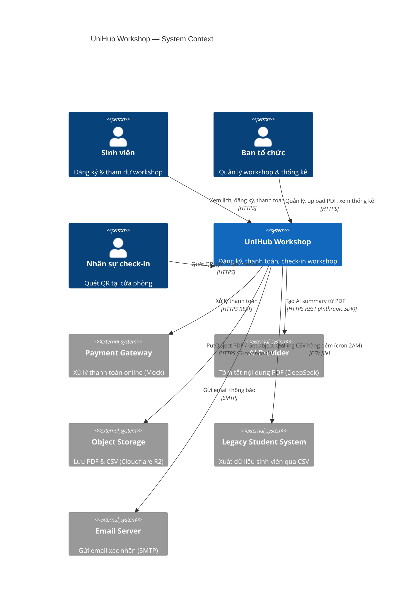

# C4 Diagram — Level 1: System Context

Thể hiện UniHub Workshop trong bức tranh toàn cảnh: ai dùng hệ thống và hệ thống ngoài nào được tích hợp.

## Ghi chú

| Actor | Mô tả |
|-------|-------|
| **Sinh viên** | ~12.000 người, đăng ký và tham dự workshop |
| **Ban tổ chức** | Quản trị viên nội bộ, tạo/sửa workshop, upload PDF |
| **Nhân sự check-in** | Staff tại cửa phòng, dùng mobile app quét QR |

| Hệ thống ngoài | Giao thức | Ghi chú |
|----------------|-----------|---------|
## Luồng tương tác chính

1. **Sinh viên → UniHub:** Xem danh sách workshop, đăng ký (HTTPS). Sau đăng ký hệ thống gửi email xác nhận qua Email Server.
2. **Sinh viên → Payment Gateway (qua UniHub):** Khi đăng ký workshop có phí, UniHub gọi Payment Gateway để xử lý thanh toán.
3. **UniHub → AI Provider:** Khi BTC upload PDF, file được lưu lên Object Storage; worker đọc lại qua `GetObject` rồi gọi DeepSeek để tạo summary.
4. **Legacy System → UniHub:** Hàng đêm (2AM), Legacy System drop file CSV vào Object Storage; cron UniHub `ListObjectsV2` để tìm và xử lý.

## Ghi chú

| Hệ thống | Giao thức | Ghi chú |
|----------|-----------|---------|
| Payment Gateway | HTTPS REST | Mock server (Wiremock) cho test failure mode |
| AI Provider | HTTPS REST (Anthropic SDK) | DeepSeek API (`baseURL: https://api.deepseek.com/anthropic`), model `deepseek-v4-flash`, abstract qua `AIProvider` interface |
| Object Storage | HTTPS S3-compatible | Cloudflare R2 — PDF workshops (`workshops/{id}/`), CSV input (`students_*`), error quarantine (`errors/`) |
| Legacy Student System | CSV file | Không có API, one-way export hàng đêm |
| Email Server | SMTP | Mailpit (dev) hoặc SMTP service thật |
