# High-Level Architecture Diagram

Sơ đồ thể hiện luồng dữ liệu và sự phụ thuộc giữa các thành phần của hệ thống UniHub Workshop, tập trung vào ba điểm tích hợp ngoài (Legacy Student System, Payment Gateway, AI Provider) và luồng check-in offline.

> Sơ đồ này hoạt động ở mức **data-flow và dependency**, không phải deployment. Kiến trúc 5 lớp và module boundaries xem tại [`../01_architecture.md`](../01_architecture.md). Sơ đồ C4 Level 1 & 2 xem tại [`c4-context.md`](./c4-context.md) và [`c4-container.md`](./c4-container.md).

---

## Sơ đồ tổng quan

```mermaid
flowchart TD
    %% ═══════════════════════════════════════
    %% ACTORS
    %% ═══════════════════════════════════════
    student(["Sinh viên\n~12.000 users"])
    organizer(["Ban tổ chức"])
    staff(["Nhân sự check-in"])

    %% ═══════════════════════════════════════
    %% EXTERNAL INTEGRATION POINTS
    %% ═══════════════════════════════════════
    legacy[/"Legacy Student System\nCSV drop — 02:00 AM daily"\]
    gateway[/"Payment Gateway\nWiremock Mock — HTTPS REST"\]
    deepseek[/"AI Provider — DeepSeek v4-flash\nAnthropic SDK"\]
    smtp[/"Email Server — SMTP"\]

    %% ═══════════════════════════════════════
    %% CLIENT LAYER
    %% ═══════════════════════════════════════
    subgraph ClientLayer["Client Layer"]
        web["Web Portal\nNext.js 16 · shadcn/ui"]
        mobile["Mobile App\nExpo · React Native"]
        sqliteDB[("SQLite local\nOffline ticket cache\n+ checkin queue")]
    end

    %% ═══════════════════════════════════════
    %% BACKEND — NESTJS MODULAR MONOLITH
    %% ═══════════════════════════════════════
    subgraph BackendAPI["Backend API — NestJS 11 Modular Monolith"]
        subgraph CoreModules["Core Modules"]
            booking["booking\nOptimistic Lock · seat counter"]
            payment["payment\nCircuit Breaker · idempotency"]
            checkin["checkin\nBatch sync endpoint"]
            catalog["catalog\nCRUD · cache-aside"]
        end
        subgraph BgModules["Background & Async"]
            csvSync["csv-sync\nBatch pipeline · 500 rows/batch"]
            aiSummary["ai-summary\nPipe-and-Filter"]
            notifSvc["notification\nStrategy Pattern · fan-out"]
            cronWorker["background\ncron 02AM · reconciliation"]
        end
    end

    %% ═══════════════════════════════════════
    %% ASYNC QUEUES — BULLMQ
    %% ═══════════════════════════════════════
    subgraph Queues["Async Messaging — BullMQ via Redis"]
        qNotif[["queue: notification"]]
        qAI[["queue: ai-summary"]]
        qStudent[["queue: student-sync\n(attempts: 1 · no retry)"]]
    end

    %% ═══════════════════════════════════════
    %% STORAGE LAYER
    %% ═══════════════════════════════════════
    subgraph StorageLayer["Storage & State Layer"]
        pg[("PostgreSQL · Neon\nSource of truth")]
        redis[("Redis · Upstash\nCache · Rate-limit · CB state")]
        r2[("Object Storage · Cloudflare R2\nPDF · CSV input · error files")]
    end

    %% ═══════════════════════════════════════
    %% DATA FLOWS
    %% ═══════════════════════════════════════

    %% Actors → Clients
    student & organizer -->|"HTTPS"| web
    staff --> mobile

    %% Clients → Backend
    web -->|"HTTPS REST · JWT"| CoreModules

    %% ── Luồng 1: Đăng ký + Thanh toán ──────────────────────────
    booking -->|"GET seat cache\nsliding window"| redis
    booking -->|"OL UPDATE seats_available\nINSERT registration"| pg
    payment -->|"CB state · idempotency key"| redis
    payment -->|"HTTPS · timeout 5s\n(forward idempotency key)"| gateway
    payment -->|"UPDATE payment status\nregistration.status = PAID"| pg
    booking & payment -->|"addJob"| qNotif

    %% Catalog
    catalog -->|"cache-aside · TTL 10s"| redis
    catalog --- pg

    %% ── Luồng 2: Check-in Offline ───────────────────────────────
    mobile <-->|"scan → write local\n(no network needed)"| sqliteDB
    sqliteDB -.->|"PENDING rows\ntrigger: network restore / 30s timer"| mobile
    mobile -->|"POST /checkins/sync\n(when online · batch 50)"| checkin
    checkin -->|"INSERT ON CONFLICT DO NOTHING\n(first-wins)"| pg

    %% ── Luồng 3: CSV Nightly Pipeline ───────────────────────────
    legacy -->|"drop file\nstudents_YYYY-MM-DD.csv"| r2
    cronWorker -->|"StudentSyncSchedulerCron\nListObjectsV2 · pick newest\nenqueue StudentSyncJobData"| qStudent
    qStudent -->|"StudentSyncWorker\nRedis lock TTL 3600s\n(concurrency: 1)"| csvSync
    csvSync -->|"GetObject × 2 passes\n500 rows/batch upsert"| r2
    csvSync -->|"UPSERT ON CONFLICT DO UPDATE\n(password_hash preserved)"| pg
    csvSync -->|"addJob (on errors)"| qNotif

    %% ── Luồng 4: AI Summary ─────────────────────────────────────
    web -->|"upload PDF (BTC)\nPutObject"| r2
    catalog -->|"addJob"| qAI
    qAI --> aiSummary
    aiSummary -->|"GetObject PDF"| r2
    aiSummary -->|"Anthropic SDK"| deepseek
    aiSummary -->|"store summary_text"| pg

    %% ── Notification (async) ────────────────────────────────────
    qNotif --> notifSvc
    notifSvc -->|"SMTP"| smtp

    %% ═══════════════════════════════════════
    %% STYLING
    %% ═══════════════════════════════════════
    classDef extSystem   fill:#fef3c7,stroke:#d97706,color:#78350f
    classDef storageNode fill:#dbeafe,stroke:#2563eb,color:#1e3a8a
    classDef queueNode   fill:#ede9fe,stroke:#7c3aed,color:#4c1d95
    classDef clientNode  fill:#dcfce7,stroke:#16a34a,color:#14532d
    classDef actorNode   fill:#f9fafb,stroke:#9ca3af,color:#374151

    class legacy,gateway,deepseek,smtp extSystem
    class pg,redis,r2 storageNode
    class qNotif,qAI,qStudent queueNode
    class web,mobile,sqliteDB clientNode
    class student,organizer,staff actorNode
```



---

## Chú thích màu sắc

| Màu | Nhóm | Ví dụ |
|-----|------|-------|
| Vàng nhạt | Hệ thống tích hợp ngoài | Payment Gateway, AI Provider, Legacy CSV, SMTP |
| Xanh dương nhạt | Storage & State | PostgreSQL, Redis, Object Storage |
| Tím nhạt | Async queue | BullMQ: notification, ai-summary |
| Xanh lá nhạt | Client apps | Web Portal, Mobile App, SQLite local |
| Xám nhạt | Actors / Người dùng | Sinh viên, Ban tổ chức, Nhân sự |

---

## Bốn luồng dữ liệu chính

### Luồng 1 — Đăng ký & Thanh toán có phí

```
Sinh viên → Web Portal → booking (Redis seat cache + PostgreSQL OL)
                       → payment (Redis CB state → Payment Gateway → PostgreSQL)
                       → BullMQ notification → SMTP
```

Điểm đặc biệt: Payment Gateway được bảo vệ bởi **Circuit Breaker** (Redis). Timeout 5s → payment `UNRESOLVED` → reconciliation job xử lý sau. Client retry dùng cùng idempotency key.

### Luồng 2 — Check-in Offline (Mobile)

```
Staff → Mobile App ↔ SQLite local   (luôn ghi được, không phụ thuộc mạng)
                   → POST /checkins/sync  (khi mạng phục hồi · batch 50)
                   → checkin module → PostgreSQL (INSERT ON CONFLICT DO NOTHING)
```

Điểm đặc biệt: **Server-wins conflict resolution** — hai staff quét cùng QR offline, request nào đến server trước thắng. Device time chỉ dùng cho audit; `received_at` (server) dùng để tie-break.

### Luồng 3 — CSV Nightly Import (Legacy Integration)

```
Legacy System → drop students_YYYY-MM-DD.csv → Object Storage (R2)

StudentSyncSchedulerCron (cron 02:00 AM · Asia/Ho_Chi_Minh)
  → ListObjectsV2 prefix="students_" → pick newest by LastModified
  → StudentSyncService.triggerSync()
      INSERT student_sync_jobs (status='RUNNING', triggered_by='CRON')
      enqueue queue: student-sync { jobId, sourceFileName }

StudentSyncWorker (concurrency: 1)
  → acquire Redis lock: student-sync:job:{jobId}:lock (SET NX · TTL 3600s)
    lock fail → skip (job already processing)
  → StudentSyncService.processJob(jobId)

  Stage 2 — Scan Pass (1st GetObject stream)
    Validate CSV headers · build dedup map student_code → last_row_number (last-wins)

  Stage 3 — Validate & Upsert Pass (2nd GetObject stream)
    Per row: validate student_code /^\d{8}$/, email RFC 5321, full_name non-empty
    Invalid → StudentSyncErrorsRepository.createBatch (quarantine)
    Valid   → batch 500 rows → INSERT ... ON CONFLICT (student_id) DO UPDATE
              SET email, full_name, updated_at (password_hash NEVER overwritten)
              batch fail → fallback individual upserts (error isolation per row)

  Stage 4 — Finalize & Notify
    StorageService.uploadText → errors/students_YYYY-MM-DD-{jobId}.csv (fire-and-forget)
    UPDATE student_sync_jobs (status SUCCESS|PARTIAL_FAILURE|FAILED, counts, completed_at)
    IF error_rows > 0 → enqueue notification → BTC users (CSV_IMPORT_COMPLETED_WITH_ERRORS)
    release Redis lock
```

Điểm đặc biệt: **One-way integration** — không có API để gọi ngược Legacy. Pipeline idempotent: chạy cùng file N lần cho kết quả giống hệt. Invalid rows bị cách ly vào `student_sync_errors`, không làm dừng valid rows. Manual trigger: `POST /admin/imports/trigger` (BTC role).

### Luồng 4 — AI Summary (PDF → DeepSeek)

```
Ban tổ chức → upload PDF (Web Portal) → Object Storage (R2)
catalog module → addJob → BullMQ queue: ai-summary
worker → GetObject R2 → DeepSeek API (Anthropic SDK) → store summary → PostgreSQL
```

Điểm đặc biệt: Hoàn toàn **async** — workshop không bị block trong lúc AI xử lý. AI Provider được abstract qua `AIProvider` interface để dễ swap. Failure chỉ mark `summary_status = 'FAILED'`, không ảnh hưởng workshop hay registration.
